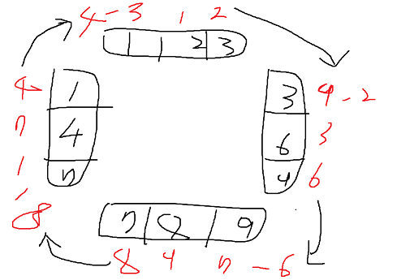

## [표 병합](https://school.programmers.co.kr/learn/courses/30/lessons/118670)

---

lv4 문제이지만 문제에서 요구하는것은 의외로 단순하다. ShiftRow와 Rotate 연산 두 가지를 어떻게 효율적으로 동작하도록 하느냐가 주요한 문제이므로, 그 외에 특별한 알고리즘은 필요치 않다.

먼저 ShiftRow부터 살펴보면, 모든 행이 한 칸씩 아래로 밀리는 쿼리이다. 당연히 매 쿼리마다 실제로 Row를 아래로 밀어주는 동작을 할 필요는 없다. 어떤 row가 시작점이 되는지를 설정하고 이를 매 ShiftRow마다 -1 해주고, 최종 결과를 구할 때 해당 시작점부터 rc를 표시해주기만 하면 될 것이다.

따라서 간단히 head라는 시작 row의 index를 정의하는 변수를 지정하고 이 값을 변경해주고, 마지막 결과에서 head index부터 row를 표시해주기만 하면 끝날 문제이다. 여기까지는 매우 쉽다.

---

문제는 Rotate이다. Rotate는 직사각형의 네 외곽선이 영향을 받는다. 위와 아래는 row로서 구현이 되있기 때문에 head와 동일한 방법으로 시작 index를 변경하면 밀리는 동작을 구현할 수 있을 것 같다.

그런데 좌 우는 어떤가? 좌 우는 여러 개의 row의 시작과 끝 값의 집합이다. 이 자체로는 array를 활용한 어떠한 연산을 하기가 까다롭다.

또한 javascript를 사용하는 데에 한해서 (물론 다른 언어에서 값의 추가와 삭제가 O(1)이 아닌 어떠한 연결형 자료구조를 사용하는 것에서도) 이러한 연산에 shift, pop, push 등의 연산을 하는 것은 매우 부담스럽다. 쿼리에 의해 각 외곽선의 시작점과 끝점은 끊임없이 변한다. 각 외곽선의 길이는 최대 50000이므로 값의 추가나 삭제시 다른 값이 끊임없이 밀리는 구조라면 절대 효율성 조건을 통과할 수 없다.

결론적으로 각 배열은 그대로 놔두고 오직 시작점만을 변화시키면서 연산을 하는것이 가장 효율적이다. 나는 계산을 좀 더 직관적으로 하기 위해서 각 row 뿐만 아니라 가장 왼쪽 col, 가장 오른쪽 col도 따로 저장하고, 각 col의 시작점, 그리고 모든 row의 시작점을 저장하는 것으로 초기 설정을 해두었다.

rowHeads는 각 row의 시작점이 어디인지를 저장한다. 이 값에 따라 앞으로의 모든 연산에서 각 row가 어디서부터 시작하는지를 알 수 있다.

leftCol과 rightCol은 시작부터 가장 왼쪽 값들과 가장 오른쪽 값들만을 저장하며, lColHead와 rColHead는 이 두 배열의 시작점을 저장한다. 앞으로의 모든 연산에서 해당 column에서 어느 부분이 rc의 가장 위쪽인지 알 수 있다. 이 값은 전체 rc의 시작점인 head와 연동된다.

따라서 이제 모든 column의 head와 모든 row의 head를 알고있다. 다음은 연산에 따라 적절하게 이를 변경해주기만 하면 된다.

ShiftRow는 매우 쉽다. 모든 직사각형이 통째로 아래로 내려가므로, head와 leftCol, rightCol이 모두 -1 된다.

rotate는 조금 복잡하다. 외곽선의 각 방향에 따라 head가 변하는 방향이 조금씩 다르다. 여기에 대해서 일일히 설명하기 보다는 그림을 표시하는 것이 나을 것 같다.

위 그림과 같이 네 외곽선의 head를 변경해주면서, 변경된 head의 반대편 값을 이동방향에 알맞은 다른 row의 끝 값으로 변경해 주어야 한다.

추가로 이러한 방식에 한해서, 좌측 및 우측 외곽선 값은 언제나 leftCol, rightCol을 신뢰해야 한다. row의 양끝값은 신뢰할 수 없다. 이는 rotate 시에는 row의 양끝값이 갱신되지만, shiftRow 시에는 이 값들이 갱신되지 않고 head만 갱신되기 때문이다. 따라서 rotate 연산 전, 마지막 rc를 표시하기 전에는 각 row의 양끝값은 모두 leftCol, rightCol에서 가지고 와야만 한다.

이 방법으로 코드 줄수도 상당히 짧고, 효율성 조건도 널널하게 통과할 수 있었다.
