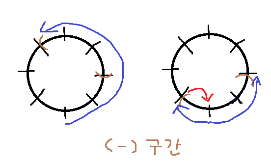

## [코딩테스트 연습 조이스틱](https://school.programmers.co.kr/learn/courses/30/lessons/42860)

---

해결 방안의 도출이 상당히 힘들었던 문제이다. 해결방법은 greedy라고는 하나 dfs로도 풀린다고 한다.

먼저 문제에서 도출할 수 있는 중요한 조건은 다음과 같다.

1. 어떤 지점의 목표가 A 가 아니라면, 그 지점은 반드시 방문해야 한다. 즉 A인 위치는 무시할 수도 있다.

2. 1의 이유에 의해서 조이스틱을 상하로 움직이는 횟수는 정해져있다. 이는 최적화 대상이 아니다.

3. 따라서 최적화 해야 할 것은 조이스틱을 좌우로 움직이는 횟수이고, 이것의 최대값은 한쪽 방향으로 계속 움직였을 경우인 name.length-1이다.

4. 1에 의해서 1개 이상의 A가 연속적으로 배치되어있는 경우, 이 구간중 한 구간을 방문하지 않고도 단어를 만들 수 있다. 두 개 이상의 구간을 방문하지 않는 것은 그 구간사이에 A가 아닌 단어가 존재하게되므로 불가능하다.

5. 따라서 조이스틱 좌우 횟수의 최소값은, 연속적인 A 한 구간을 제외하고 나머지 구간을 최소 횟수로 전부 방문했을 때의 값들 중 최소값이다.

먼저 name을 이용해 이름의 각 알파벳에 드는 이동 비용 리스트를 만든다. 이것 역시도 위 아래로 움직일 수 있으므로, A에서 올라가던 Z쪽으로 내려가던 최소값을 저장해준다. 그리고 전체 값을 합해 저장한다. 이것이 상하 이동횟수의 총합이다.

조이스틱은 좌측 끝에서 우측 끝으로 한번에 움직일 수 있기 때문에 이 리스트는 환형이라고 보아도 무방하다. 이 원형 구간에서 순회를 돌며 비용이 0인, 즉 A인 위치를 찾고, 그 위치에서 좌우로 0이 끝날때 까지 구간을 넓힌다. 시작 지점이 0이고 리스트가 환형이기 때문에 좌우를 모두 찾아주어야 한다. 어떤 구간은 length-i 부터 0 그리고 j 까지 걸쳐있을 수 있다.

그렇다면 이제 구간은 그 0 구간을 제외한 나머지 구간 즉 꼭 방문해야만 하는 구간의 양끝값을 가지고 있을 것이다. 이제 이 구간을 모두 방문할 때의 최소 이동횟수를 구해 저장된 좌우 이동횟수 move와 비교해 갱신하면 된다.

여기서 두 가지 경우로 나뉘는데, 방문해야 할 구간이 index 0을 포함하고 있거나 그렇지 않은 경우이다.

먼저 그렇지 않은경우는 간단하다. 되돌아갈 필요가 없고 한쪽 방향으로만 진행해도 무방하며 우측 끝값 과 length-좌측 끝값 중 작은 값을 갱신하면 된다.

하지만 방문해야 할 구간이 index 0을 포함하고 있다면, 시작지점이 0이기 때문에 한 번 되돌아갈 필요가 있다. 따라서 0에서부터 좌측 끝값까지의 이동거리와 우측 끝값까지의 이동거리를 더한 후, 더 작은길로 먼저 갔다고 치고 둘 중 작은것을 한번 더 더해주면 된다.

이렇게 모든 위치를 확인하고 나면 최소값인 좌우 이동횟수가 저장되어 있을 것이다. 이 값과 상하 이동횟수를 더한 값이 답이다.
